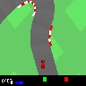
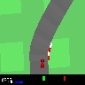

# README

This is an implementation of Q-Learning to solve this Open AI
gym environment https://gym.openai.com/envs/CarRacing-v0/ using PyTorch.

More details in the source file:
https://github.com/openai/gym/blob/master/gym/envs/box2d/car_racing.py

### Requirements

Tested with:
- Ubuntu 18.04
- Nvidia RTX 2070 card
- Cuda 10.2
- CuDNN 7.6.5

```
pip install -r requirements.txt
```

### How to play the game

```
./play.sh
```

## Models

Models, configurations and outputs on [Google Drive](https://drive.google.com/drive/folders/1zAPVtHHQdLWlo41upGfnlQPIbosR-Q6Y?usp=sharing).

### Configuration changes

|           Model name         |      Main configuration improvement(s)     |
|------------------------------|--------------------------------------------|
| model_basic_openai_stop_expl | Stop after 50 negative consecutive rewards |

### Results

| Model name | Training episodes | Test average score (10 runs *)  | Short example | Notes |
|------------|-------------------|----------------------------------|---------|-------|
| model_basic_openai_stop_expl | 450 | 690 | | It fails the tight curves, but not every time. It is also able to rejoin the track from out of track situations. |
| model_basic_openai_stop_expl | 500 | 723 | | Almost perfect guide, the limit on the score is the prudence on gas. It fails in rare tight curve situations. |
| model_basic_openai_stop_expl | 550 | N/A | N/A | More on gas, but completely wrong with only 50 more training episodes.|

(*) Test runs should be around 100 to be reliable.